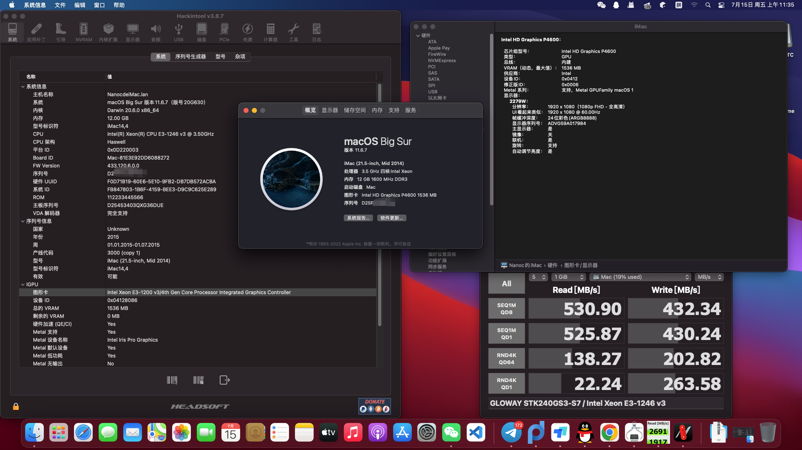

# MSI-H81M-P33-Hackintosh-EFI
MSI H81M-P33 Hackintosh-EFI, and the CPU is E3 1246 V3 ( haswell )

## 说明
> 自制EFI，能力有限，不保证任何的性能和可靠性，一切后果由您自己承担。

|  Hardware   | Detail  |
|  ----  | ----  |
| Motherboard  | MSI H81M P33 |
| CPU  | E3 1246 V3 Haswell |

- BIOS Version is latest
- 未加装任何额外的硬件。

## 测试结果
+ 核显正常
+ 声卡正常
+ 网卡正常
+ CPU正常
+ H264硬件解码
+ 睡眠正常
+ 温度正常
+ Speedtest 带宽测速正常（400Mbps+浮动，带宽满速为450Mbps）
+ 不支持HEVC硬件解码

## 问题
+ 开机会卡鼠标20秒左右，之后一切正常，可能是我的SATA硬盘读取太慢了？
+ 使用VGA可能会有问题，请尽量使用DVI接口

> 测试时间为 2022/7/14
> 模拟平台为iMac14,4
> 安装镜像为macOS Big Sur 11.6.7

## 注意
+ opencore version 0.8.2
+ 安装镜像为macOS Big Sur 11.6.7, Catalina 和 Mojave  也可以引导成功
+ 从 OpenCore 0.7.2 版本开始，早期的 APFS 驱动不会被加载 (出于安全性考虑)，这会导致低于 Big Sur 11.0 版本的系统无法启动，如果要启动 Catalina 或更早版本的系统，请修改配置文件 UEFI > APFS 下面的 MinDate 和 MinVersion 为-1，详情参考 OC 0.7.2 版本 中的文档。
+ 4代Intel核显没有HEVC硬件解码
+ E3 1246 V3 核显为 P4600

## 更多
请关注``OPENCORE``官网以及善于利用搜索引擎，远景论坛，Google。
除此之外，你可以在这里下载到相关系统镜像
> https://macoshome.com/macos

## 界面
